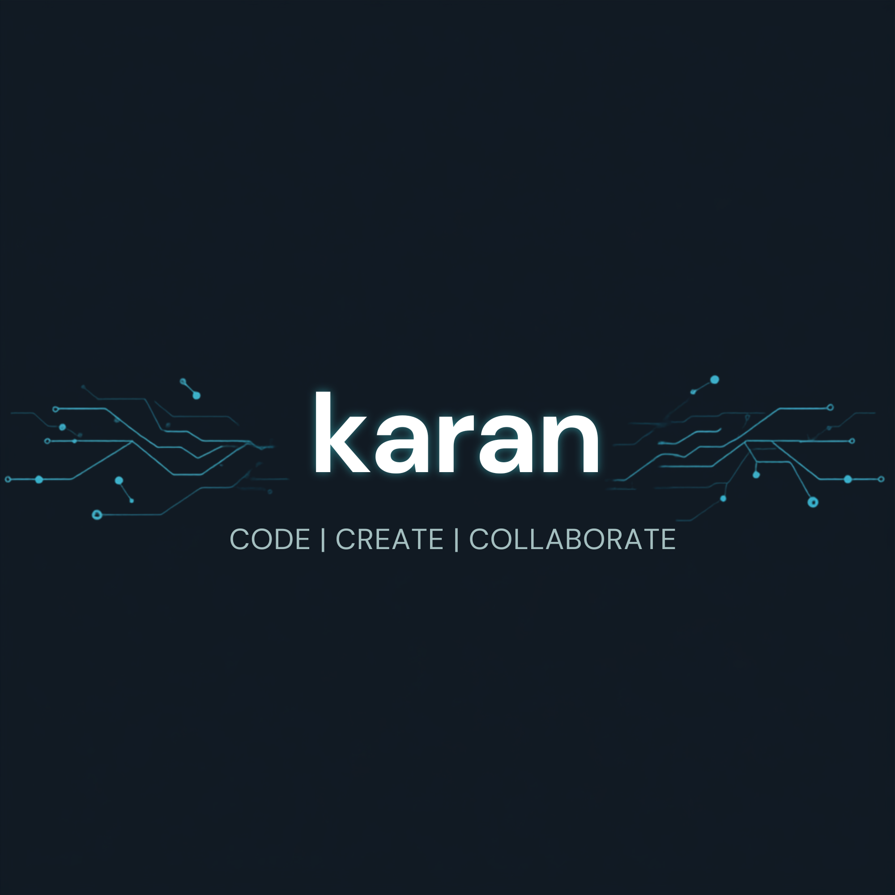

<!-- Banner -->
<!-- 👉 Replace this with your own banner image uploaded to your repo -->

<!-- Social Badges -->

<!-- Typing Animation -->

---

## ⭐ Key Highlights 🎯

| Full Stack & Frontend | Backend, Cloud & Architecture |
|---|---|
| Build scalable MERN/MEAN apps with React.js, Next.js, Angular 16+, and React Native | Design microservices with Nest.js, Kafka, RabbitMQ, and event-driven distributed systems |
| Expert in component-based UI with Redux, Zustand, NgRX, RxJS, Tailwind CSS, and Ag-Grid | Architect REST/RESTful APIs with Redis caching — improved response times by 40% |
| Delivered 5+ production-grade apps serving thousands of users with 99.9% uptime | Reduced project delivery time by 25% using AI-assisted development workflows |

---

## 👨‍💻 About Me

- 🔭 Currently working as a **Software Engineer at Nova Techset Software Service Ltd, Pune**
- ⚙️ Specializing in **MERN/MEAN stack, Microservices, Kafka, RabbitMQ, PostgreSQL, Redis, and AWS**
- 🌐 Built platforms across **Fintech, Insurance, E-commerce, Procurement, HR & Auction domains**
- 🧩 Strong in **React.js, Angular, Next.js, Node.js, Nest.js, TypeScript, Docker, CI/CD**
- 🏆 Awarded **Employee of the Quarter** for exceptional technical contributions
- 📚 Active **LeetCode** practitioner with strong DSA foundation
- 📫 Reach me at **karan.b.jamadar@gmail.com** | 📞 +91-8550910072

---

## 💻 Tech I Use

---

## 🚀 Featured Projects

| Project | Stack | Highlights |
|---|---|---|
| **Procbay** - Procurement & Sourcing Platform | Angular, Nest.js, PostgreSQL, Kafka, RabbitMQ | Microservices + event-driven architecture for enterprise vendor management |
| **LOS** - Loan Origination System | Angular 18, AgGrid, NgRX, RxJS, Tailwind CSS | Reduced loan turnaround time by **35%** with automated credit pipelines |
| **RMS** - Resource Management Portal | Angular 18, NgRX, RESTful APIs | RBAC HR portal — real-time tracking for **200+ managers** |
| **TrexoPro** - E-commerce Platform | Next.js, Nest.js, MySQL, Redux | **10x traffic** during sales; 99.5% transaction success rate |
| **Auto Bazaar** - Vehicle Auction Platform | Nest.js, Kafka, Redis, PostgreSQL | **500+ concurrent bidders**, sub-second latency, 99% uptime |
| **Bajaj Allianz** - Rapid Claim Settlement | React.js, Bootstrap, RESTful APIs | Cut claim settlement from **7 days → 2 days** via automation |
| **PAYzz** - International Money Transfer | React.js, React Native, Plaid API | Cross-platform fintech with biometric auth & Plaid integration |

---

## 💼 Experience

| Role | Company | Duration | Focus |
|---|---|---|---|
| **Software Engineer** | Nova Techset Software Service Ltd, Pune | Sept 2022 – Present | MERN/MEAN, Microservices, Kafka, PostgreSQL, Redis, AWS, CI/CD |

---

## 🎓 Education & Certifications

| Degree / Certification | Institution | Year |
|---|---|---|
| MCA - Master of Computer Application | Sinhagad College, SPPU Pune | 2022 – 2024 |
| BCS - Bachelor of Computer Science | AM College, SPPU Pune | 2019 – 2022 |
| Mastering System Design Principles | Udemy | 2025 |
| Time Management with AI: Smarter Productivity | Udemy | 2025 |
| Spring Boot 3, Spring 6 & Hibernate | Udemy | 2023 |
| The Complete Web Development Bootcamp | Udemy | 2022 |

---

## 📊 My GitHub Stats

---

## 🌐 Connect With Me
 

